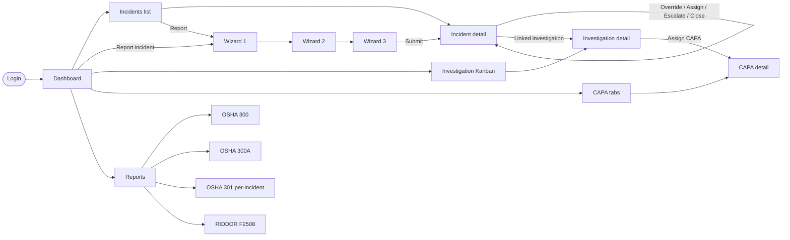

# EHS Incident Management — UI Flow & Page Specification

**Status:** Living document
**Companion docs:** `docs/SPEC.md` (data model, workflow rules) · `docs/design.md` (visual tokens, component recipes) · `docs/onboarding.md` (per-role first-run flows, admin setup wizard, sandbox mode, tooltip inventory)
**Last updated:** 2026-05-05

This is the **page-by-page contract**: every route, what it shows, what the user can do, where each action takes them, and how state flows. Read this alongside `docs/SPEC.md` (the **what**) and `docs/design.md` (the **look**). This file is the **how** — the user's journey and the application's structure.

---

## 1. Information architecture

### 1.1 Route map

```
/                                       → redirect to /dashboard or /login
/login                                  Public · Sign in
/register                               Public · Create account (Phase 12)
/verify-otp                             Public · Verify email OTP (demo: 8484; Phase 12)
/forgot-password                        Public · Request password reset (Phase 12)
/reset-password                         Public · Apply new password from magic-link (Phase 12)
/onboarding                             New users · Org + first site + invites wizard (Phase 12)
/auth/callback                          Public · Supabase auth code exchange
/dashboard                              All roles · KPIs + banners + activity
/incidents                              All roles · List (scope per role)
/incidents/new/1                        Worker+ · Wizard step 1 (what happened)
/incidents/new/2                        Worker+ · Wizard step 2 (details + risk matrix)
/incidents/new/3                        Worker+ · Wizard step 3 (review + submit)
/incidents/[id]                         Visible per RLS · Incident detail
/investigations                         Supervisor+ · Kanban
/investigations/[id]                    Supervisor+ · Investigation detail
/capa                                   Supervisor+ · Tabbed CAPA view
/capa/[id]                              Visible per RLS · CAPA detail + verify form
/reports                                EHS Manager+ · Reports landing
/reports/osha-300                       EHS Manager+ · OSHA 300 Log live preview
/reports/osha-300a                      EHS Manager+ · OSHA 300A annual summary
/reports/osha-301/[incidentId]          EHS Manager+ · Per-incident 301 form
/reports/riddor-f2508/[incidentId]      EHS Manager+ · UK F2508 form
/admin/site-setup                       Site Admin · 7-step wizard (see docs/onboarding.md §5)
/admin/site-setup/[step]                Site Admin · Wizard steps 1–7
/settings                               All users · Account preferences (profile, password, theme, sign out)
/admin/* (stub)                         Site Admin · Users, roles (deferred to P3+)
```

Modals are URL-driven where it matters (deep-linkable, refresh-safe) via `?action=...`. Pure UI concerns (confirms) are local state.

### 1.2 Role-based access matrix

| Page / area | Worker | Supervisor | EHS Manager | Site Admin |
|---|---|---|---|---|
| `/dashboard` | ✅ (own data) | ✅ (site) | ✅ (site) | ✅ (all) |
| `/incidents` (list) | own only | site | site | all |
| `/incidents/new/[step]` | ✅ | ✅ | ✅ | ✅ |
| `/incidents/[id]` view | own only | site | site | all |
| `/incidents/[id]` override severity | ❌ | ✅ | ✅ | ✅ |
| `/incidents/[id]` triage modals | ❌ | ✅ | ✅ | ✅ |
| `/investigations` | ❌ (hidden) | read-only | full | full |
| `/investigations/[id]` 5-Why edit, evidence | ❌ | assignee only | ✅ | ✅ |
| `/capa` (tabs) | own CAPAs only | own + assigned | full | full |
| `/capa/[id]` complete | owner only | owner only | owner only | n/a |
| `/capa/[id]` verify | non-owner only | non-owner only | non-owner only | non-owner |
| `/reports/*` | ❌ | read-only | full (export, submit) | full |
| `/admin/*` | ❌ | ❌ | ❌ | ✅ |

**Sidebar visibility** mirrors this — hidden links don't appear in nav. Direct URL access is also blocked at the layout (server-side `requireRole()` helper).

### 1.3 Top-level navigation (sidebar)

| Item | Worker | Supervisor | EHS Manager | Site Admin |
|---|---|---|---|---|
| Dashboard | ✅ | ✅ | ✅ | ✅ |
| Report Incident _(deep link to `/incidents/new/1`)_ | ✅ | ✅ | ✅ | ✅ |
| Incidents | "My reports" | "Site" | "Site" | "All" |
| Investigations | — | ✅ | ✅ | ✅ |
| CAPA | "My CAPAs" | ✅ | ✅ | ✅ |
| Reports | — | "Read-only" | ✅ | ✅ |
| Admin | — | — | — | ✅ |

---

## 2. Auth flow

### 2.1 Sign in
```
[unauthenticated] → /any-protected-route
   ↓ proxy.ts redirects (preserves ?next= param)
/login
   ↓ enter email + password → server action signIn()
   ↓ Supabase issues session cookie
[authenticated] → /dashboard (or ?next= if present)
```

### 2.2 Sign out
- User menu → "Sign out" → `signOut()` server action → redirect to `/login`
- Session cookie cleared; protected routes will redirect on next nav

### 2.3 Session expiry
- `proxy.ts` calls `supabase.auth.getClaims()` on every request
- Expired session → redirect to `/login?next=<original>`
- After re-auth, user lands back on the original page

### 2.4 First-time login
- For demo: the 4 seeded accounts already exist (`worker@demo.local`, `supervisor@demo.local`, `ehs@demo.local`, `admin@demo.local`); password `Demo!2026`
- For production: invite-via-email flow (deferred to v1.5+)
- **First-run welcome and tour** — every role gets a one-time welcome card + tour cards on first dashboard visit (state on `profiles.seen_welcome` + `profiles.tour_completed`). See **`docs/onboarding.md`** for full per-role flows, copy, and time-to-success targets.
- **Site admin special case** — if site has `setup_completed_at IS NULL`, admin is routed to `/admin/site-setup` instead of `/dashboard`. See `docs/onboarding.md` §5.

### 2.5 Demo affordances on the login page
A small "**Demo accounts**" panel below the form shows the 4 demo emails as click-to-fill chips. **Hidden in production** via `process.env.NODE_ENV === 'development'` or a `DEMO_MODE` env flag.

---

## 3. Application shell

Every authenticated page renders inside `app/(app)/layout.tsx`:

```
┌────────────────────────────────────────────────────────────────┐
│  TOPBAR                                                        │ 56px
│  [Site switcher ▾]              [🔔 N]  [Avatar ▾]             │
├──────────┬─────────────────────────────────────────────────────┤
│ SIDEBAR  │  REGULATORY BANNER (only when active)               │
│ 240px    │  ─────────────────────────────────────────────────  │
│ (80px    │                                                     │
│  collapsed)                                                    │
│          │  PAGE CONTENT                                       │
│ Dashboard│  - Page header (title, breadcrumbs, primary CTA)    │
│ Incidents│  - Body (varies per route)                          │
│ Investig.│                                                     │
│ CAPA     │                                                     │
│ Reports  │                                                     │
│          │                                                     │
└──────────┴─────────────────────────────────────────────────────┘
```

### 3.1 Sidebar
- Default expanded (240 px); user can collapse to 80 px (icon-only)
- Active route highlighted with brand purple left-border + tinted bg (per `docs/design.md` §6.5)
- Role-aware items (see §1.3)
- Bottom of sidebar: "Help" + version stamp

### 3.2 Topbar
- **Site switcher** — when user belongs to multiple sites; persists choice in `selected_site` cookie; route refresh on change
- **Help drawer** — role-based quick links + FAQ
- **Argus avatar** (Phase 9a) — Sparkles icon in cyan (`#00D4FF`) right of the help drawer; opens the global `<ArgusSidePanel>` (right-aligned shadcn Sheet). Hidden when `orgs.argus_enabled = false` OR the user lacks the `argus:use` permission OR `ANTHROPIC_API_KEY` is unset (in the last case the panel renders an "AI is offline" empty state if forced open, never a 500). 9b–9e populate the panel with page-context-aware features (Copilot in the Report Wizard, Investigator on `/investigations/[id]`, magic-wands at decision points, Dashboard insight tiles).
- **Notification bell** — count of active regulatory deadlines; opens dropdown with the active list
- **Avatar menu** — name, role, site, "Profile" (deferred), "Sign out"

### 3.3 Regulatory banner
Sticky below topbar when ≥ 1 unresolved high-priority notification exists. Spec in `docs/design.md` §6.6. Click "Mark notified" → `acknowledgeNotification()`.

### 3.4 Page header pattern
Every content page has a header with:
- Breadcrumb (Home › Investigations › INV-2026-0078)
- H2 page title
- Primary action button (if applicable, top-right)
- Optional sub-actions (filter chips, view toggles)

### 3.5 Common states
- **Loading** — Suspense boundary with skeleton (see `docs/design.md` skeleton tokens). Full-page skeletons for routes; per-card skeletons for streamed content.
- **Empty** — `<EmptyState>` component with icon, title, body, optional CTA. Different copy per page.
- **Error** — `error.tsx` boundary with retry button (`unstable_retry`). Logs `error.digest` for trace.

---

## 4. Worker journey

A worker logs in to report incidents and check on what they've reported. Minimal navigation — they don't need investigation or CAPA tools.

```
Login → Dashboard (their incidents only) → "Report Incident" CTA
   → /incidents/new/1 (Step 1)
   → /incidents/new/2 (Step 2 — conditional fields based on type)
   → /incidents/new/3 (Step 3 — review)
   → submit → /incidents/[id] (their newly-created incident detail, read-only)
   → back to Dashboard sees their report at top of "My Reports"
```

### 4.1 What workers see
- Their own incidents only (RLS-enforced)
- KPI tile: "Total reports filed" + "Open" + "Closed"
- Activity feed: their own activity only
- No regulatory banner (workers don't act on OSHA/RIDDOR deadlines)
- No Investigations or Reports nav items

### 4.2 Reporting time budget
Target: ≤ 4 minutes for a routine first-aid injury, with photos. Optimization levers:
- Type cards on Step 1 with one-tap selection
- Body map clickable regions (no typing for body part)
- Risk matrix clickable cells (no scoring numbers)
- Auto-save per step (draft survives refresh)

---

## 5. Supervisor journey

A supervisor reviews their team's incidents, overrides severity if needed, and triages.

```
Login → Dashboard (site-wide) → spot a new incident in activity feed
   → /incidents/[id] → review details
   → if severity wrong: open "Override Severity" modal → submit
   → choose triage path:
        S1/S2: "Escalate to Investigation" modal → creates investigation row
        S3:    "Assign Triage Owner" modal → assigns owner
        S4/S5: "Close — no action" modal → closes incident
   → for assigned/escalated cases: monitor on /investigations
```

---

## 6. EHS Manager journey

The richest journey — they own investigations, assign CAPAs, and run reports.

```
Login → Dashboard (site-wide + reg banners)
   → /investigations (Kanban) → drag card to "In Progress"
   → /investigations/[id] → fill 5-Why → upload evidence → write findings
   → at close: "Assign CAPA" → CAPA create modal → verifier picked
   → /capa (CAPAs they own/assigned) → monitor progress
   → at month-end: /reports/osha-300 → export to ITA CSV
```

---

## 7. Independent Verifier journey

Any non-owner can verify (it's a function not a role — see SPEC.md §11). The "Pending Verification" queue surfaces what they need to act on.

```
Login → /capa?tab=pending_verification → see CAPAs awaiting them
   → /capa/[id] → review the owner's completion evidence
   → "Verify Closure" form:
        choose verification_method (inspection / monitoring / etc.)
        choose verification_result:
          - effective → CAPA closed
          - partially_effective → CAPA closed, follow-up CAPA auto-created
          - not_effective → CAPA back to in_progress with reason
          - too_early_to_verify → set re_verify_at date
```

---

## 8. Page-by-page specification

Each page below uses the same template: **Route · Access · Purpose · Sections · Actions · States · Server actions · Cache strategy · Phase.** (See §13 for the canonical phase mapping.)

### 8.1 `/login`

- **Route:** `/login`
- **Access:** Public
- **Purpose:** Authenticate the user and route them to `/dashboard` (or `?next=`).
- **Sections (top → bottom):**
  - Centered card (max-width 400 px) on `--background-cool`
  - Brand mark + product name
  - Email input
  - Password input
  - Inline error region (above submit)
  - Submit button (full width, primary)
  - Demo accounts panel _(dev/demo only)_
- **Actions:**
  | CTA | Effect |
  |---|---|
  | Submit | `signIn(email, password)` → on success `redirect('/dashboard' \|\| next)` |
  | Demo chip click _(dev only)_ | Pre-fills email + password fields |
- **States:**
  - Empty: form rendered with helper text
  - Loading: submit button disabled, spinner
  - Error: inline message ("Invalid credentials")
- **Server actions:** `lib/actions/auth.ts → signIn(prev, fd)`
- **Cache strategy:** none (form is uncached client component)
- **Phase:** **0** (foundation, shipped)

### 8.2 `/auth/callback`

- **Route:** `/auth/callback`
- **Access:** Public
- **Purpose:** Exchange Supabase auth code for session (used by magic-link or OAuth — currently no-op for password auth, kept as a stub).
- **Sections:** none (route handler, not a page)
- **Phase:** **0** (shipped)

### 8.3 `/dashboard`

- **Route:** `/dashboard`
- **Access:** All authenticated
- **Purpose:** At-a-glance health of EHS at the user's site (or scope).
- **Sections (top → bottom):**
  1. **Regulatory banners** (active OSHA/RIDDOR deadlines with countdown, see `docs/design.md` §6.6) — uncached, real-time
  2. **KPI tiles** (4 cards): TRIR, DART, Severity Rate, Open Incidents — cached with `cacheTag('kpi:'+siteId)`
  3. **Incidents-by-type chart** (12-month trend, recharts bar) — cached
  4. **Three-track summary** (mini cards: Track A / B / C counts) — cached
  5. **Recent incidents** (top 8 from `incidents` filtered by role/site) — uncached + Suspense
  6. **Activity feed** (latest 20 from `activity_events`) — uncached + Suspense
- **Actions:**
  | CTA | Effect |
  |---|---|
  | "Report Incident" (header) | `/incidents/new/1` |
  | Click incident row | `/incidents/[id]` |
  | Click banner action link | Opens deep-link modal or external (HSE / OSHA) |
- **States:**
  - Worker variant: shows only their own data, hides team-level KPIs (or shows "—")
  - Empty (fresh tenant): "No incidents yet — file your first report" CTA
- **Server actions:** none on this page (read-only)
- **Cache strategy:**
  - `'use cache'` on KPI tiles (`cacheTag('kpi:'+siteId)`, invalidated by any incident/CAPA mutation)
  - `'use cache'` on chart data (`cacheTag('incidents:trend:'+siteId+':'+year)`)
  - Suspense for live banners + activity (no `'use cache'`)
- **Phase:** **1**

### 8.4 `/incidents`

- **Route:** `/incidents`
- **Access:** All authenticated; scope varies (worker = own; supervisor+ = site)
- **Purpose:** Browse and filter incidents.
- **Sections:**
  1. **Header** — title "Incidents", primary CTA "Report Incident" (top-right)
  2. **Tab strip** — `?tab=all | open | mine | closed` (default `all` for managers, `mine` for workers)
  3. **Filter row** — Type, Severity, Track, Site, Date range, OSHA-recordable toggle, RIDDOR-reportable toggle. Filters live in URL (`?type=injury&severity=S1`)
  4. **Table**
     - Columns: Ref code · Title · Type (with color dot) · Severity badge · Track · Site · Date · Status · Reporter avatar
     - Row click → `/incidents/[id]`
     - Sort by clicking column header (URL `?sort=occurred_at&dir=desc`)
     - Pagination (20/page, `?page=2`)
- **Actions:**
  | CTA | Effect |
  |---|---|
  | "Report Incident" | `/incidents/new/1` |
  | Filter chip | Updates URL search params, server re-fetches |
  | Row click | `/incidents/[id]` |
  | Tab switch | `?tab=...` |
- **States:**
  - Empty (no matches): "No incidents match — try clearing filters"
  - Empty (no data): "No incidents yet — file your first report"
- **Server actions:** none (read-only); URL state drives query
- **Cache strategy:** `'use cache'` per `(siteId, tab, filters, page)` with `cacheTag('incidents:'+siteId)`
- **Phase:** **1**

### 8.5 `/incidents/new/1` — Wizard Step 1

- **Route:** `/incidents/new/1`
- **Access:** All authenticated
- **Purpose:** Capture "what happened" — the universal first step.
- **Sections:**
  1. **Stepper header** — 1 (active) → 2 → 3 with progress
  2. **Type chooser** — 8 cards in a 4×2 grid (Injury / Illness / Near-miss / Property Damage / Environmental Release / Unsafe Condition / Observation / Dangerous Occurrence). Each card has icon + label + 1-line definition. Click selects.
  3. **Title** input (≤ 200 chars)
  4. **Date / time picker** (defaults to "now")
  5. **Site** select (defaults to user's site)
  6. **Area** select (filtered by site) + **Specific location** free text
  7. **Description** textarea (≥ 50 words; word counter; voice-to-text icon — deferred)
  8. **Attachments** dropzone (max 25 MB each, image/PDF MIME types)
- **Actions:**
  | CTA | Effect |
  |---|---|
  | "Continue to Step 2" | `createDraft()` server action → INSERT row `status='draft'` → `redirect('/incidents/new/2?id=<uuid>')` |
  | "Cancel" | confirm dialog → discard draft → `/incidents` |
- **States:**
  - Validation errors inline on submit (Zod-driven)
  - Loading: button → spinner
  - Error: toast + form preserved
- **Server actions:** `lib/actions/incidents.ts → createDraft(prev, fd)`
- **Cache strategy:** uncached (form)
- **Phase:** **1**

### 8.6 `/incidents/new/2` — Wizard Step 2

- **Route:** `/incidents/new/2?id=<uuid>`
- **Access:** Reporter of the draft (RLS)
- **Purpose:** Capture type-specific details + risk classification.
- **Sections:**
  1. **Stepper header** — 1 ✓ → 2 (active) → 3
  2. **Conditional sub-form** based on incident type from Step 1 (server-rendered):
     - **Injury** — Injured Person fields, Body Map, Injury nature/mechanism, Object/substance (OSHA 301 #17), Treatment, OSHA recordable, days_away, days_restricted, fatality
     - **Illness** — Same as Injury minus body map specifics; adds illness category, exposure, substance/agent
     - **Near-miss** — Potential severity, hazard category, contributing factors, immediate actions, repeat flag
     - **Property Damage** — Equipment, damage type, cost estimate, repair plan
     - **Environmental Release** — Substance, CAS, quantity, where it went, containment, regulatory flags
     - **Unsafe Condition** — Hazard type, current controls, suggested action
     - **Observation** — Type (positive/negative), category, follow-up
     - **Dangerous Occurrence** — Schedule 2 type, persons at risk, equipment, HSE notification record fields
  3. **5×5 Risk Matrix** (component per `docs/design.md` §6.7) — interactive; selected cell computes severity client-side for preview, server re-validates on submit
  4. **PPE checklist** (multi-select chips; injury/illness only)
  5. **Witnesses repeater** (universal; up to 5)
- **Actions:**
  | CTA | Effect |
  |---|---|
  | "Back to Step 1" | `/incidents/new/1?id=<uuid>` (preserves draft) |
  | "Continue to Step 3" | `saveStep2()` → UPDATE draft row → `redirect('/incidents/new/3?id=<uuid>')` |
- **Server actions:** `saveStep2(prev, fd)`
- **Cache strategy:** uncached
- **Phase:** **1**

### 8.7 `/incidents/new/3` — Wizard Step 3

- **Route:** `/incidents/new/3?id=<uuid>`
- **Access:** Reporter (RLS)
- **Purpose:** Final review before classification + submission.
- **Sections:**
  1. **Stepper header** — 1 ✓ → 2 ✓ → 3 (active)
  2. **Summary card** — type, title, when, where, reporter, computed severity preview, computed track preview, OSHA/RIDDOR flags
  3. **What happens next** info box:
     - "Severity will be set to: <S2>"
     - "Track: <A — Full Investigation>"
     - "OSHA 8hr / 24hr deadline (if applicable)"
     - "Investigation will be auto-created"
  4. **Edit links** back to Step 1 / Step 2 to fix anything
- **Actions:**
  | CTA | Effect |
  |---|---|
  | "Back to Step 2" | `/incidents/new/2?id=<uuid>` |
  | "Submit" (primary) | `finalizeIncident()` → severity engine + routing + notifications + (if A/B) auto-create investigation → `redirect('/incidents/[id]')` + success toast |
- **Server actions:** `finalizeIncident(prev, fd)` (atomic transaction)
- **Cache strategy:** uncached form; on success calls `updateTag('incidents')`, `updateTag('kpi:'+siteId)`
- **Phase:** **1**

### 8.8 `/incidents/[id]` — Incident detail

- **Route:** `/incidents/[id]`
- **Access:** Per RLS (worker = own; supervisor+ = site)
- **Purpose:** Read-only view of the incident with triage actions.
- **Sections (top → bottom):**
  1. **Header** — Ref code + title; badges (severity, track, status, OSHA recordable, RIDDOR reportable)
  2. **Triage action bar** _(supervisor+ only)_ — buttons: Override Severity · Assign · Escalate · Close (visibility per §1.2)
  3. **Two-column body:**
     - Left (60%):
       - "What happened" card (description, date, location, site, area)
       - Type-specific details card (e.g. Injured Person + Body Map readonly for injury)
       - Attachments gallery
       - Witnesses list
     - Right (40%):
       - Severity card with override audit (latest entry)
       - Reporter card
       - Linked Investigation card _(if any)_ → click → `/investigations/[id]`
       - Linked CAPAs list _(if any)_
       - Activity timeline
- **Modals (URL-driven):**
  - `?action=override` → Severity Override modal
  - `?action=assign` → Assign Triage Owner modal
  - `?action=escalate` → Escalate to Investigation modal
  - `?action=close` → Close Incident (Track C) modal
- **Actions:**
  | CTA | Effect |
  |---|---|
  | Open modal (above) | URL param updates; modal renders client-side |
  | Linked investigation card | `/investigations/[id]` |
  | Linked CAPA item | `/capa/[id]` |
- **States:**
  - For closed incidents: triage bar hidden; status badge shows "Closed YYYY-MM-DD"
  - For drafts: redirects to `/incidents/new/[lastStep]` (drafts shouldn't reach detail)
- **Server actions (called by modals):** `overrideSeverity`, `assignTriageOwner`, `escalateToInvestigation`, `closeIncident`
- **Cache strategy:** `'use cache'` with `cacheTag('incident:'+id)`; modals invalidate via `updateTag`
- **Phase:** **1**

### 8.9 `/investigations`

- **Route:** `/investigations`
- **Access:** Supervisor+ (read-only for supervisor; full for EHS Manager+)
- **Purpose:** Manage active investigations on a Kanban board.
- **Sections:**
  1. **Header** — title, view toggle (Kanban | List), filters (lead, severity, site, date range)
  2. **Kanban board** — 4 columns: Pending Assignment · In Progress · Awaiting CAPA · Closed
     - Cards show: ref code · title · severity badge · lead avatar · due_date chip (yellow if ≤ 3 days, red if overdue)
     - Drag between columns triggers status change (optimistic + server action)
- **Actions:**
  | CTA | Effect |
  |---|---|
  | Drag card | `advanceInvestigation(id, newStatus)` |
  | Click card | `/investigations/[id]` |
  | View toggle | `?view=list` (URL state) |
- **States:**
  - Empty: "No investigations yet"
  - List view: same data, table format
- **Server actions:** `advanceInvestigation(id, status)`
- **Cache strategy:** uncached (status changes frequently); list of investigations cached on `cacheTag('investigations:'+siteId)`
- **Phase:** **2**

### 8.10 `/investigations/[id]` — Investigation detail

- **Route:** `/investigations/[id]`
- **Access:** Per RLS
- **Purpose:** Conduct the investigation — RCA, evidence, findings, team.
- **Sections:**
  1. **Header** — Ref code + title; status; due_date countdown; "Close investigation" button (top-right, dropdown: "Close — no CAPA" / "Assign CAPA")
  2. **OSHA 301 draft banner** — sticky, shows "OSHA 301 due in N days" if source incident is OSHA-recordable; click → opens 301 form pre-filled
  3. **Tab strip:**
     - **Summary** (default) — incident summary card (frozen snapshot), team list
     - **5-Why** — chain of 5 questions; Why-5 has ROOT CAUSE badge; autosave on each row
     - **Evidence** — gallery + uploader (drag-drop to Supabase Storage)
     - **Findings** — rich text area; autosave
     - **AI Investigator** _(Phase 9c)_ — Sparkles + cyan accent; visible only when `orgs.argus_enabled = true`, caller has `argus:use` + `investigation:edit`, and the investigation is open. Paste + voice/text witness inputs → Sonnet 4.6 (one-shot, forced `tool_choice`) returns a structured `{ timeline, 5-Why, root_cause_summary, findings }` draft. Each card is editable in place; per-card Push commits via the existing `saveInvestigationText` / `saveWhy` actions and writes `argus_suggestions` outcome + `activity_events` audit rows. Confirm-dialog (Replace / Append / Cancel) when Pushing onto a non-empty target field; 5-Why chain is replace-only. Witnesses added in this tab stay client-side until first Push. URL `?tab=ai` falls back to Summary in any of the gating misses.
     - **Timeline** — derived from `activity_events`; reverse-chrono
- **Modals:**
  - "Close — no CAPA needed" confirm
  - "Assign CAPA" → opens CAPA-create modal pre-filled with investigation context
  - "Reassign lead" → user picker
- **Actions:**
  | CTA | Effect |
  |---|---|
  | Add team member | `addInvestigationTeamMember()` |
  | Edit Why-N | `saveWhy(level, question, answer)` (autosave debounced 1s) |
  | Upload evidence | `uploadEvidence()` → Storage + DB row |
  | Save findings | `saveFindings()` (autosave) |
  | Close — no CAPA | `closeInvestigation(id, withCapa=false)` → `/investigations` |
  | Assign CAPA | opens modal → on submit `createCapa()` + `closeInvestigation(id, withCapa=true)` |
- **Server actions:** `addInvestigationTeamMember`, `saveWhy`, `uploadEvidence`, `saveFindings`, `closeInvestigation`, `createCapa`
- **Cache strategy:** `'use cache'` on summary tab + team; uncached on Timeline (live)
- **Phase:** **2**

### 8.11 `/capa`

- **Route:** `/capa`
- **Access:** All authenticated; scope per role
- **Purpose:** Manage CAPAs across their lifecycle.
- **Sections:**
  1. **Header** — title; filter chips (type, owner, due range); "+ New CAPA" button
  2. **KPI strip** — Active · Pending Verification · Overdue · Closed (counts; click filters list)
  3. **Tabs** — `?tab=mine | active | pending_verification | overdue | closed | all`
  4. **Table per tab:**
     - Ref code · Title · Type · Owner · Verifier · Due date · Progress bar · Status badge
     - Row click → `/capa/[id]`
- **Actions:**
  | CTA | Effect |
  |---|---|
  | Click tab | `?tab=...` |
  | Click row | `/capa/[id]` |
  | "+ New CAPA" _(EHS Manager+)_ | opens CAPA-create modal (no investigation prefill) |
- **States:**
  - Tab counts shown in tab labels (e.g. "Overdue (3)")
  - Empty per tab: contextual message
- **Server actions:** none on list
- **Cache strategy:** `'use cache'` per tab; `updateTag('capas:'+siteId)` on any CAPA mutation
- **Phase:** **2**

### 8.12 `/capa/[id]` — CAPA detail

- **Route:** `/capa/[id]`
- **Access:** Per RLS
- **Purpose:** View, update progress, mark complete, or verify a CAPA.
- **Sections:**
  1. **Header** — Ref code + title; status badge; due_date countdown
  2. **Two-column body:**
     - Left (60%):
       - Description card
       - Implementation evidence uploader (owner)
       - Verification form _(non-owner only when status = `pending_verification`)_
     - Right (40%):
       - Source investigation link
       - Owner card (with progress slider — owner-only edit)
       - Verifier card
       - Activity timeline
- **Verification form (visible to non-owner, status = `pending_verification`):**
  - **`verification_method`** select (inspection / monitoring / audit_trend / re_interview / document_review)
  - **`verification_result`** radio group (4 outcomes)
  - **Notes** textarea
  - **`re_verify_at`** date picker (only when "Too early to verify")
  - "Submit verification" button
- **Actions:**
  | CTA | Visible to | Effect |
  |---|---|---|
  | Update progress | Owner | `updateCapaProgress(pct)` (slider, debounced) |
  | "Mark complete" | Owner | `completeCapa(id)` → status `pending_verification` |
  | Upload evidence | Owner | `uploadCapaEvidence()` |
  | "Verify Closure" → submit | Non-owner | `verifyCapa(result, method, notes, re_verify_at?)` → branch by result |
  | "Reassign verifier" | Site Admin / EHS Manager | `reassignVerifier(newId)` (logged) |
- **Critical UX rule:** when viewer is the owner, the Verification form is NOT shown (not just disabled). When viewer is non-owner, the Verification form IS shown but only after status = `pending_verification`. Server action enforces both conditions independently.
- **Server actions:** `updateCapaProgress`, `completeCapa`, `uploadCapaEvidence`, `verifyCapa`, `reassignVerifier`
- **Cache strategy:** `'use cache'` on detail data; uncached on activity feed
- **Phase:** **2**

### 8.13 `/reports`

- **Route:** `/reports`
- **Access:** EHS Manager+ (Supervisor read-only)
- **Purpose:** Reports landing — pick a regulatory output.
- **Sections:**
  1. **Header** — title, "Year" filter (default current), "Site" filter (default user's site)
  2. **Four report cards (2×2 grid):**
     - **OSHA 300 Log** — count of recordable cases YTD; "Open log" → `/reports/osha-300`
     - **OSHA 300A Annual Summary** — "Posting period: Feb 1 – Apr 30"; "Generate" → `/reports/osha-300a`
     - **OSHA 301 Reports** — count of incidents needing 301; "Browse" → table of incidents linking to `/reports/osha-301/[id]`
     - **RIDDOR F2508** — count of UK-reportable cases; "Browse" → table linking to `/reports/riddor-f2508/[id]` _(GB sites only)_
- **Phase:** **2**

### 8.14 `/reports/osha-300`

- **Route:** `/reports/osha-300`
- **Access:** EHS Manager+
- **Purpose:** Live preview of the OSHA 300 Log (13 columns A–M).
- **Sections:**
  1. **Header** — Site, Year, Establishment ID, NAICS code (read-only confirmation row)
  2. **Toolbar** — Export PDF · Export CSV (ITA format) · "Submit to ITA" button (opens guidance modal)
  3. **Table** — 13 columns A–M, paginated; filter by month
- **Actions:**
  | CTA | Effect |
  |---|---|
  | Export PDF | streams via route handler `/api/reports/osha-300/pdf?year=&site=` |
  | Export CSV | streams ITA-format CSV |
  | Submit to ITA | opens guidance modal with OSHA ITA URL + CSV download link (we don't ship a real API submission for v1) |
- **Phase:** **2**

### 8.15 `/reports/osha-300a`

- **Route:** `/reports/osha-300a`
- **Access:** EHS Manager+
- **Purpose:** Annual summary with TRIR / DART / Severity Rate, ready for printing/posting Feb 1 – Apr 30.
- **Sections:**
  1. **Header** — Year + Site
  2. **Establishment info** card — name, address, NAICS, EIN (placeholder)
  3. **Counts grid** — Total cases · Cases w/ days away · Cases w/ restriction or transfer · Cases w/ other recordable · Total days away · Total days restricted
  4. **Injury type counts** — 6 categories (per Form 300A)
  5. **Annual hours** input (manual; persisted on `sites.annual_hours_<year>` JSONB or similar)
  6. **Calculated metrics** — TRIR, DART, Severity Rate (auto-computed from counts + hours)
  7. **Certification block** — manager name, title, signed date (digital sign-off; deferred to v1.5)
  8. **"Print / Export PDF" button**
- **Phase:** **2**

### 8.16 `/reports/osha-301/[incidentId]`

- **Route:** `/reports/osha-301/[incidentId]`
- **Access:** EHS Manager+
- **Purpose:** Per-incident OSHA 301 form (18 fields), pre-filled.
- **Sections:** Top-to-bottom, the 18 fields per OSHA Form 301, with field 14–17 (the narrative core) prominent. Field 17 ("object/substance that directly harmed the employee") is captured from `injured_persons.object_substance`.
- **Actions:**
  | CTA | Effect |
  |---|---|
  | "Edit" | inline form (corrections to pre-filled values; saves to incident/injured_person) |
  | "Generate PDF" | opens `/api/reports/301/[incidentId]` (PDF download) |
- **Phase:** **2**

### 8.17 `/reports/riddor-f2508/[incidentId]`

- **Route:** `/reports/riddor-f2508/[incidentId]`
- **Access:** EHS Manager+ on UK incidents
- **Purpose:** UK F2508 form per RIDDOR.
- **Sections:**
  - Pre-filled F2508 fields
  - **HSE notification record** card — phone-call timestamp, who called, HSE phone reference, written-submission timestamp, RIDDOR online reference (manually entered after the regulator interaction)
- **Actions:** Generate PDF · Mark phone notification recorded · Mark online submission recorded
- **Phase:** **2**

### 8.18 `/admin/*` (stub)

- **Route:** `/admin` and sub-routes
- **Access:** Site Admin only
- **Purpose:** Manage sites, users, roles, notification rules. Out of demo scope; stubbed `<EmptyState>` for now.
- **Phase:** **post-v1**

---

## 9. Modal & dialog inventory

All modals follow `docs/design.md` Dialog/Sheet specs. Most are URL-driven (`?action=...`) so they're deep-linkable and refresh-safe.

| Modal | Trigger | URL | Form fields | On submit |
|---|---|---|---|---|
| **Severity Override** | `/incidents/[id]?action=override` | new severity (S1–S5 picker), reason (required, ≥ 20 chars) | `overrideSeverity()` writes audit row, recomputes track, re-fires notifications |
| **Assign Triage Owner** | `/incidents/[id]?action=assign` | owner picker (site users), notes | `assignTriageOwner()` |
| **Escalate to Investigation** | `/incidents/[id]?action=escalate` | lead picker (defaults to current user if EHS Manager), team (multi), due_date | `escalateToInvestigation()` creates investigation row, redirects to `/investigations/[id]` |
| **Close Incident — Track C** | `/incidents/[id]?action=close` | reason | `closeIncident()` sets `closed_at` |
| **CAPA Create** | `/investigations/[id]` "Assign CAPA" or `/capa` "+ New CAPA" | type, title, description, owner, verifier (must ≠ owner — UI blocks selection of owner as verifier), due_date | `createCapa()` |
| **Verify CAPA Closure** | `/capa/[id]` (inline form, not modal) | method, result, notes, optional re_verify_at | `verifyCapa()` branches by result |
| **Reject Verification** | n/a (handled by `verifyCapa` with `result='not_effective'`) | reason | reverts CAPA to `in_progress` |
| **Sign-out confirm** | User menu | none | `signOut()` |
| **Discard draft confirm** | Wizard "Cancel" | none | DELETE draft, redirect to `/incidents` |

---

## 10. State machines

### 10.1 Incident
```
draft  ──▶ submitted ──▶ classified ──┬──▶ under_investigation ──▶ awaiting_capa ──▶ closed
                                      │
                                      └──▶ closed (Track C, no investigation)
```
Side effects on `classified`: severity engine runs, routing engine assigns track, notification engine fires deadlines, investigation row is auto-created if track A/B.

### 10.2 Investigation
```
pending_assignment ──▶ in_progress ──▶ awaiting_capa ──▶ closed
                                  │
                                  └──▶ closed (no CAPA)
```

### 10.3 CAPA (5 stages with verification branch)
```
created ──▶ in_progress ──▶ completed ──▶ pending_verification ──┬──▶ verified ──▶ closed
                ▲                                                │
                │                                                ├──▶ in_progress (not_effective: rejected)
                │                                                │
                └────────────────────────────────────────────────┤
                                                                 ├──▶ verified ──▶ closed (partially_effective: also auto-creates a follow-up CAPA)
                                                                 │
                                                                 └──▶ pending_verification (too_early_to_verify: re_verify_at set)
```

### 10.4 Notification
```
created ──▶ acknowledged ──▶ resolved
```
Acknowledged = user clicked "Mark notified". Resolved = the underlying deadline is satisfied (e.g. F2508 submitted, or 24-hour window expired).

---

## 11. URL state conventions

| Pattern | Meaning | Example |
|---|---|---|
| `?tab=` | Active tab on multi-tab pages | `/capa?tab=overdue` |
| `?view=` | View toggle (kanban/list/grid) | `/investigations?view=list` |
| `?action=` | URL-driven modal | `/incidents/123?action=override` |
| `?id=` | Wizard draft id | `/incidents/new/2?id=<uuid>` |
| `?next=` | Post-login redirect target | `/login?next=/dashboard` |
| `?type=&severity=` | Filter chips | `/incidents?type=injury&severity=S1` |
| `?sort=&dir=` | Sort | `/incidents?sort=occurred_at&dir=desc` |
| `?page=` | Pagination | `/incidents?page=2` |

URL state is **owned by the URL, not by client state** — copy/paste a link and you land on the same view. Server reads `searchParams: Promise<{...}>` (Next 16 async params).

---

## 12. Navigation map (mermaid)



---

## 13. Phase mapping (page-by-page)

> Phases match the v1 plan agreed 2026-05-06 — see `docs/SPEC.md` §15 entry "V1 phase split agreed". **Vertical slicing** (one module fully done before the next), **demo-ready at the end of every phase**, full depth, ~6.5 weeks total. Phase 0 is shipped; Incidents gets two phases due to scope. Pages listed below at the phase level; full per-page §8 specs for Templates / Inspections / Resources / Planner will be added when each phase's `plans/0X-*.md` file is written.

| Phase | Goal (demo state at end of phase) | Pages / scope |
|---|---|---|
| **0** *(shipped 2026-05-05, PR #1)* | Foundation: auth shell, schema, RBAC tables seeded, route stubs all resolve | `/login`, `/auth/callback`, `app/(app)/layout.tsx`, all 9 named-route stubs; welcome card component; schema delta from `docs/onboarding.md` §15 |
| **1** | **Incidents — capture → classify → route.** Worker logs in → 3-step Report Wizard → severity + routing + notifications fire → supervisor sees it in list with triage modals working | `/dashboard` (basic with KPI placeholder), `/incidents` (list + filters), `/incidents/new/[1,2,3]` (wizard with sandbox banner), `/incidents/[id]` (detail + Severity Override / Assign / Escalate / Close modals), `/admin/site-setup/[1..7]` (**7-step Site Setup Wizard** — moved here from old P3); `lib/rbac/resolve.ts` resolver + `can()` helper (deferred from Phase 0); severity engine, routing engine, notification engine; top-bar notification bell + regulatory banner with countdowns; worker welcome card; top-8 regulatory tooltips; sandbox mode; thin file upload to `incident-attachments` bucket |
| **2** | **Incidents — investigate → CAPA → reports.** Track A incident gets RCA'd, CAPA'd, verified; OSHA 300 / 300A / 301 + RIDDOR F2508 render; daily overdue cron runs. Module is shippable on its own. | `/investigations` (Kanban), `/investigations/[id]` (5-tab detail with 5-Why builder + evidence + findings), `/capa` (5-tab list), `/capa/[id]` (detail + verify form), CAPA-create modal; `/reports` (landing), `/reports/osha-300`, `/reports/osha-300a`, `/reports/osha-301/[id]`, `/reports/riddor-f2508/[id]`, PDF/CSV exports; supervisor + EHS Manager + verifier welcome cards; help center side panel; remaining 9 regulatory tooltips; demo affordances (reset data, trigger banner, sample-data loader); sandbox auto-cleanup cron; Vercel cron for daily overdue check at site-local midnight; TRIR / DART calculator; `hse_notification_records` table + UI |
| **3** | **Templates + Inspections** *(Phases 3 + 4 collapsed 2026-05-06 — see SPEC §15)*. Admin browses an industry library, imports a preset, edits the versioned builder, publishes v1, assigns to sites. Worker runs an inspection on mobile, photo + signature uploads work, failed responses become findings, "Escalate to Incident" pre-fills the Phase 1 wizard. Editing the template publishes v2; running and historical inspections continue to honor the version they started against. | `/templates` (org-scoped imported list), `/templates/browse` (system-preset library — SafetyCulture-style card grid), `/templates/new` (blank create), `/templates/[id]/edit` (versioned builder — left sidebar items tree, central canvas, right options panel), `/templates/[id]` (read-only viewer + Versions panel), `/templates/[id]/assign` (per-site or all-sites + schedule); `/inspections` (list with status filter + start picker), `/inspections/[id]` (mobile-first runner — title-page header items, body items by section/category, per-item save, photo + signature upload), `/inspections/[id]/findings/[findingId]` (finding detail + Escalate to Incident); 8 MVP item types editable + renderable (`section`, `category`, `information`, `question`, `text`, `datetime`, `signature`, `media`); deferred 7 item types render in read-only fallback; `templates`, `template_versions` (with `header` / `items` / `template_data` JSONB), `template_assignments`, `inspections` (with `template_version_id` snapshot), `inspection_uploads`, `inspection_findings`, `inspection_assignees` tables; `inspection-uploads` Storage bucket with path-prefix RLS; ~14 system-preset templates seeded across 7 industries from real SafetyCulture-library payloads. **No recurring-inspection auto-creation cron** (deferred — runs are started manually via the picker). |
| **4** | **Resources — Assets + Documents.** Admin maintains asset registry per site; org-scoped document library polymorphically links from incidents / inspections / CAPAs / assets / sites; the Phase 1 thin upload upgrades to "pick from library or upload new". | `/resources/assets` (per-site registry + org roll-up), `/resources/assets/[id]` (asset detail with linked docs + last-inspected + PM dates + SDS link), `/resources/documents` (org library + search/filter), `/resources/documents/[id]` (doc detail with link list); `assets`, `documents`, `document_links` (polymorphic, typed-pair pattern) tables; reusable link-picker component used by all 5 link contexts; storage RLS path-prefix policy extended for documents bucket |
| **5** | **Planner** — unified read-only calendar across all 5 modules. | `/planner` (month / week / day grid with site filter); aggregator (Postgres union view or app-level) over incident occurred-at, inspections (started + completed), CAPA due dates, asset PM dates; click event → deep-link to source record |
| **post-v1** | Out of v1 scope, logged so we don't relitigate | `/admin/users` (role-permission editor UI — RBAC tables shipped in Phase 0, defaults editable via DB / seed in v1), magic-link auth, real OSHA ITA API submission, dark-mode toggle UI, customisable notifications, multilingual onboarding, WCAG 2.2 AA pass, IMS_PLANNING modules from §15 we don't claim (Audit, Training, MOC, Permit, BBS, JSA, Toolbox Talks, Safety Bulletins, Emergency Mgmt, Environmental Compliance) |

---

## 14. Empty / error / loading copy bank

Centralized so every empty state is consistent.

| Context | Copy |
|---|---|
| No incidents (worker, fresh) | "No reports filed yet — your first one takes about 4 minutes." + CTA |
| No incidents (manager, fresh) | "No incidents at this site yet. Once your team starts reporting, this view fills up." |
| No matches after filter | "No incidents match these filters. Clear filters to see all." |
| No investigations | "No active investigations. Investigations are auto-created when an incident is classified S1–S3." |
| No CAPAs | "No CAPAs assigned yet. Open an investigation and use 'Assign CAPA' to create one." |
| No reports data (yearly view) | "No recordable cases for {year}. Switch year to view historical data." |
| 500 error boundary | "Something went wrong. We've logged it. Try again or refresh — {digest}." + Retry button |
| 404 (incident/investigation/capa not found) | "{Entity} not found — it may have been deleted, or you may not have access." |
| Session expired (rare path) | "Your session expired. Sign in again to continue." |

---

## 15. Accessibility & keyboard

(Sketched; full WCAG 2.2 AA pass is in IMS_PLANNING.md Phase 7 — out of scope for the demo, but these are the hard floor we don't cross.)

- All interactive elements reachable via Tab; visible focus ring (uses `--ring`).
- Modals trap focus; Esc closes; restored to trigger on close.
- Wizard: Enter advances when all fields valid.
- Body Map: keyboard alternative — body-region select dropdown if user opts in (also serves color-blind users).
- Risk matrix: arrow-key navigation between cells.
- 5-Why chain: numbered as `<ol>`; semantic structure intact.
- Tabs: arrow-key navigation between tabs (Radix tabs ship with this).
- Tables: column headers `<th scope="col">`; sort buttons announce direction.
- Toast notifications visible to screen readers (Sonner has `role=status`).

---

## 16. Open UX questions

- **Wizard back navigation** — Step 2 → Step 1: should we re-validate or just navigate? Current plan: just navigate (draft persists, user can edit and re-save).
- **Concurrent editing** — two managers open the same investigation. Optimistic locking (compare `updated_at` on save) or last-write-wins? Recommend last-write-wins for v1, add optimistic later.
- **Mobile sidebar** — at < 768 px, sidebar becomes a drawer behind a hamburger. Confirm before Phase 0 wraps.
- **Dark mode toggle** — tokens are wired (see `docs/design.md` §2 dark mode), but no UI toggle. Add a switch in user menu? Recommend yes.
- **Site switcher placement** — topbar (current plan) or sidebar header? Topbar is more discoverable; sidebar saves topbar real estate. Recommend topbar.
- **Auto-save debounce** — 5-Why and Findings autosave: 1s feels right but is conservative. Open to 500ms if it doesn't thrash the DB.

---

## 17. Cross-references

- `docs/SPEC.md` — workflow rules, data model, regulatory triggers
- `docs/design.md` — visual tokens, component recipes
- `plans/00-foundation.md` — Phase 0 task list (shipped)
- `plans/01-incidents-capture.md` — Phase 1 task list (Incidents capture + classify + route; references §8.3–8.8)
- `plans/02-investigation-capa-reports.md` — Phase 2 (TBD at start of phase; §8.9–8.17)
- `plans/03-templates.md` — Phase 3 Templates + Inspections (drafted 2026-05-06; old Phase 4 collapsed in)
- `plans/04-resources.md` — Phase 4 Resources (TBD at start of phase; was Phase 5)
- `plans/05-planner.md` — Phase 5 Planner (TBD at start of phase; was Phase 6)
- `PLANNING/IMS_PLANNING.md` — production-scope roadmap (45 weeks, 15 phases)
